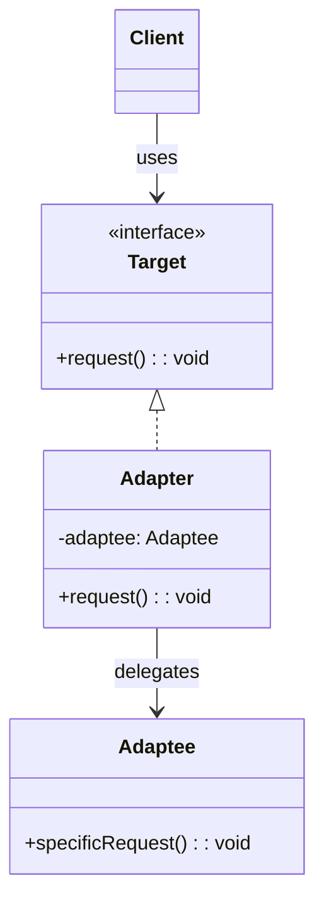

## 意图

将一个类的接口转换成客户希望的另一个接口，使原本因接口不兼容而不能一起工作的类可以协同工作。

## 类图



## Java 实现

```java
// Target interface
interface MediaPlayer {
    void play(String audioType, String fileName);
}

// Adaptee
class AdvancedMediaPlayer {
    public void playVlc(String fileName) {
        System.out.println("Playing VLC: " + fileName);
    }

    public void playMp4(String fileName) {
        System.out.println("Playing MP4: " + fileName);
    }
}

// Adapter
class MediaAdapter implements MediaPlayer {
    private AdvancedMediaPlayer advancedPlayer = new AdvancedMediaPlayer();

    @Override
    public void play(String audioType, String fileName) {
        switch (audioType.toLowerCase()) {
            case "vlc" -> advancedPlayer.playVlc(fileName);
            case "mp4" -> advancedPlayer.playMp4(fileName);
        }
    }
}

// Concrete Target
class AudioPlayer implements MediaPlayer {
    private MediaAdapter adapter;

    @Override
    public void play(String audioType, String fileName) {
        if (audioType.equalsIgnoreCase("mp3")) {
            System.out.println("Playing MP3: " + fileName);
        } else {
            adapter = new MediaAdapter();
            adapter.play(audioType, fileName);
        }
    }
}

public class AdapterDemo {
    public static void main(String[] args) {
        AudioPlayer player = new AudioPlayer();
        player.play("mp3", "song.mp3");
        player.play("mp4", "video.mp4");
        player.play("vlc", "movie.vlc");
    }
}
```

## 关键点

- 通过组合 Adaptee 实现适配，不修改原有代码
- 可同时适配多个 Adaptee
- 符合开闭原则

## 使用场景

- 集成第三方库或遗留系统
- 统一多个不兼容的接口
