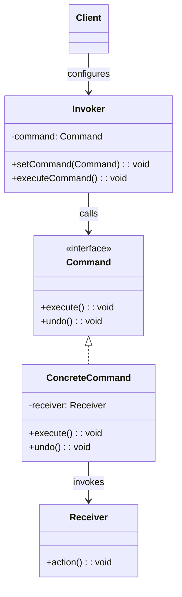

## 意图

将一个请求封装为一个对象，从而使你可用不同的请求对客户进行参数化，对请求排队或记录请求日志，以及支持可撤销的操作。

## 类图



## Java 实现

```java
// Command
interface Command {
    void execute();
    void undo();
}

// Receiver
class Light {
    public void on()  { System.out.println("Light ON"); }
    public void off() { System.out.println("Light OFF"); }
}

// Concrete Commands
class LightOnCommand implements Command {
    private Light light;
    public LightOnCommand(Light light) { this.light = light; }
    @Override public void execute() { light.on(); }
    @Override public void undo()    { light.off(); }
}

class LightOffCommand implements Command {
    private Light light;
    public LightOffCommand(Light light) { this.light = light; }
    @Override public void execute() { light.off(); }
    @Override public void undo()    { light.on(); }
}

// Invoker
class RemoteControl {
    private Command command;
    private Command lastCommand;

    public void setCommand(Command command) { this.command = command; }
    public void pressButton() {
        command.execute();
        lastCommand = command;
    }
    public void pressUndo() {
        if (lastCommand != null) lastCommand.undo();
    }
}

public class CommandDemo {
    public static void main(String[] args) {
        Light light = new Light();
        Command on = new LightOnCommand(light);
        Command off = new LightOffCommand(light);

        RemoteControl remote = new RemoteControl();
        remote.setCommand(on);
        remote.pressButton();     // Light ON
        remote.pressUndo();       // Light OFF

        remote.setCommand(off);
        remote.pressButton();     // Light OFF
    }
}
```

## 关键点

- 请求封装为对象，支持参数化和延迟执行
- 可轻松实现撤销/重做
- 支持命令队列和日志

## 使用场景

- GUI 按钮动作、事务操作、宏录制
- 需要支持撤销操作的场景
