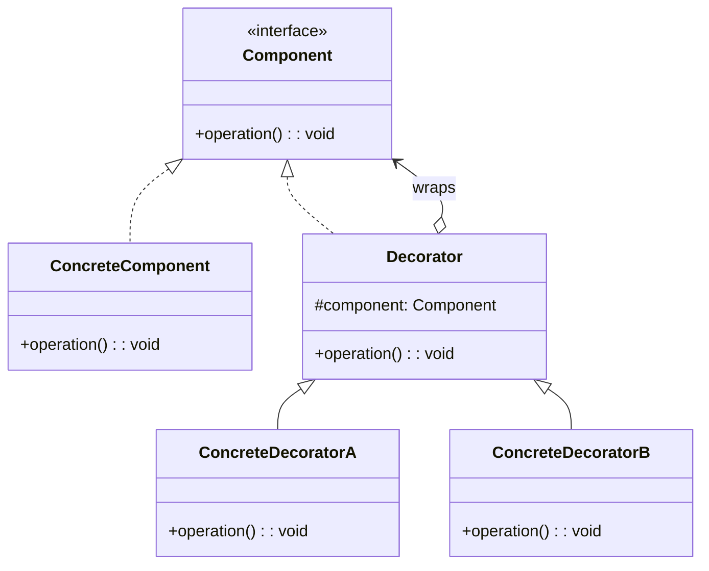

## 意图

动态地给一个对象添加一些额外的职责。就增加功能来说，Decorator 模式比生成子类更灵活。

## 类图



## Java 实现

```java
// Component
interface Coffee {
    String getDescription();
    double cost();
}

// ConcreteComponent
class SimpleCoffee implements Coffee {
    @Override
    public String getDescription() { return "Simple Coffee"; }

    @Override
    public double cost() { return 2.0; }
}

// Decorator
abstract class CoffeeDecorator implements Coffee {
    protected Coffee coffee;

    public CoffeeDecorator(Coffee coffee) {
        this.coffee = coffee;
    }

    @Override
    public String getDescription() { return coffee.getDescription(); }

    @Override
    public double cost() { return coffee.cost(); }
}

class MilkDecorator extends CoffeeDecorator {
    public MilkDecorator(Coffee coffee) { super(coffee); }

    @Override
    public String getDescription() { return coffee.getDescription() + " + Milk"; }

    @Override
    public double cost() { return coffee.cost() + 0.5; }
}

class SugarDecorator extends CoffeeDecorator {
    public SugarDecorator(Coffee coffee) { super(coffee); }

    @Override
    public String getDescription() { return coffee.getDescription() + " + Sugar"; }

    @Override
    public double cost() { return coffee.cost() + 0.3; }
}

public class DecoratorDemo {
    public static void main(String[] args) {
        Coffee coffee = new SimpleCoffee();
        coffee = new MilkDecorator(coffee);
        coffee = new SugarDecorator(coffee);
        System.out.println(coffee.getDescription() + " → $" + coffee.cost());
        // Simple Coffee + Milk + Sugar → $2.8
    }
}
```

## 关键点

- 装饰器与被装饰对象实现同一接口
- 可嵌套多层装饰，灵活组合功能
- 比继承更灵活，避免类爆炸

## 使用场景

- Java I/O 流体系（BufferedInputStream 装饰 FileInputStream）
- 需要动态添加功能的场景
