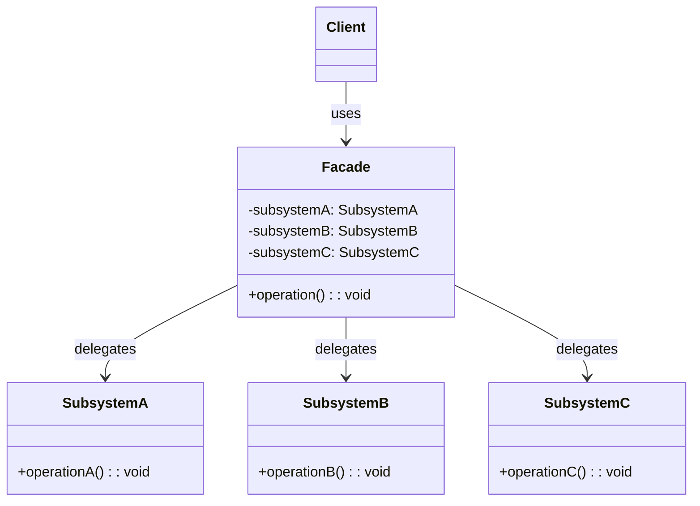

## 意图

为子系统中的一组接口提供一个统一的简化接口，隐藏子系统的复杂性。

## 类图



## Java 实现

```java
// Complex subsystems
class CPU {
    public void freeze()    { System.out.println("CPU: freeze"); }
    public void jump(long addr) { System.out.println("CPU: jump to " + addr); }
    public void execute()   { System.out.println("CPU: execute"); }
}

class Memory {
    public void load(long addr, byte[] data) {
        System.out.println("Memory: load data at " + addr);
    }
}

class HardDrive {
    public byte[] read(long lba, int size) {
        System.out.println("HardDrive: read LBA=" + lba + " size=" + size);
        return new byte[size];
    }
}

// Facade
class ComputerFacade {
    private CPU cpu = new CPU();
    private Memory memory = new Memory();
    private HardDrive hardDrive = new HardDrive();

    public void start() {
        cpu.freeze();
        memory.load(0L, hardDrive.read(0L, 1024));
        cpu.jump(0L);
        cpu.execute();
    }
}

public class FacadeDemo {
    public static void main(String[] args) {
        ComputerFacade computer = new ComputerFacade();
        computer.start();
    }
}
```

## 关键点

- 为复杂子系统提供简化接口
- 降低了客户端与子系统的耦合
- 不阻止客户端直接使用子系统

## 使用场景

- 复杂库或 API 的简易入口
- 分层系统中的门面层
