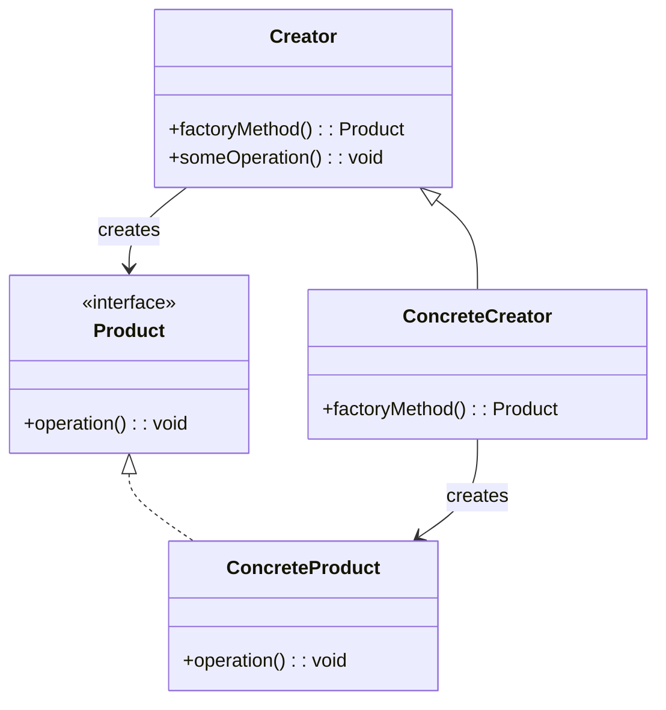

## 意图

定义一个创建对象的接口，让子类决定实例化哪一个类，使类的实例化延迟到其子类。

## 类图



## Java 实现

```java
// Product
interface Product {
    void operation();
}

class ConcreteProductA implements Product {
    @Override
    public void operation() {
        System.out.println("ConcreteProductA operation");
    }
}

class ConcreteProductB implements Product {
    @Override
    public void operation() {
        System.out.println("ConcreteProductB operation");
    }
}

// Creator
abstract class Creator {
    public abstract Product factoryMethod();

    public void someOperation() {
        Product product = factoryMethod();
        product.operation();
    }
}

class CreatorA extends Creator {
    @Override
    public Product factoryMethod() {
        return new ConcreteProductA();
    }
}

class CreatorB extends Creator {
    @Override
    public Product factoryMethod() {
        return new ConcreteProductB();
    }
}

// Client
public class FactoryMethodDemo {
    public static void main(String[] args) {
        Creator creator = new CreatorA();
        creator.someOperation();
    }
}
```

## 关键点

- 将对象创建逻辑封装在子类中
- 遵循开闭原则，新增产品无需修改现有代码
- 适用于框架中定义抽象接口的场景

## 使用场景

- 日志框架中不同日志级别对应不同 Logger 实现
- 跨平台文件导出器（PDF、Word、Excel）
