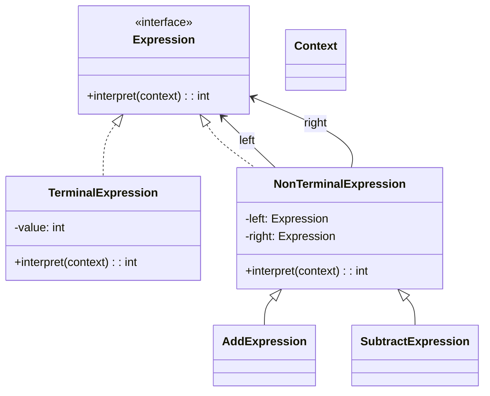

## 意图

给定一个语言，定义它的文法的一种表示，并定义一个解释器，这个解释器使用该表示来解释语言中的句子。

## 类图



## Java 实现

```java
import java.util.*;

// Context
class Context {
    private Map<String, Integer> variables = new HashMap<>();

    public void setVariable(String name, int value) {
        variables.put(name, value);
    }

    public int getVariable(String name) {
        return variables.getOrDefault(name, 0);
    }
}

// Expression
interface Expression {
    int interpret(Context context);
}

// Terminal
class NumberExpression implements Expression {
    private int number;

    public NumberExpression(int number) { this.number = number; }

    @Override
    public int interpret(Context context) { return number; }
}

class VariableExpression implements Expression {
    private String name;

    public VariableExpression(String name) { this.name = name; }

    @Override
    public int interpret(Context context) { return context.getVariable(name); }
}

// Non-terminal
class AddExpression implements Expression {
    private Expression left, right;

    public AddExpression(Expression left, Expression right) {
        this.left = left;
        this.right = right;
    }

    @Override
    public int interpret(Context context) {
        return left.interpret(context) + right.interpret(context);
    }
}

class SubtractExpression implements Expression {
    private Expression left, right;

    public SubtractExpression(Expression left, Expression right) {
        this.left = left;
        this.right = right;
    }

    @Override
    public int interpret(Context context) {
        return left.interpret(context) - right.interpret(context);
    }
}

public class InterpreterDemo {
    public static void main(String[] args) {
        // x + 2 - 1
        Context ctx = new Context();
        ctx.setVariable("x", 10);

        Expression expr = new SubtractExpression(
            new AddExpression(
                new VariableExpression("x"),
                new NumberExpression(2)
            ),
            new NumberExpression(1)
        );

        System.out.println("Result: " + expr.interpret(ctx)); // 11
    }
}
```

## 关键点

- 终结符表达式与非终结符表达式组合形成 AST
- 适用于文法简单且执行频率不高的场景
- 文法复杂时建议使用解析器生成器（如 ANTLR）

## 使用场景

- 数学表达式计算器
- SQL 解析、正则表达式引擎
- 模板语言解析
