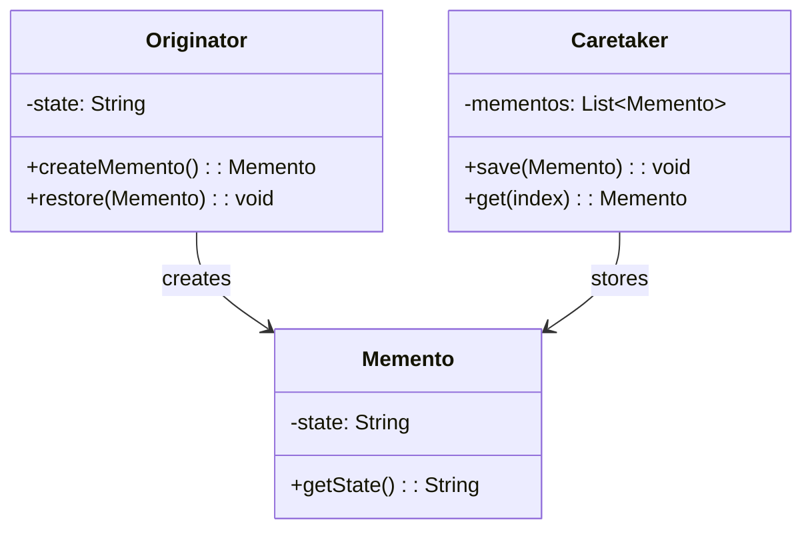

## 意图

在不破坏封装的前提下，捕获一个对象的内部状态，并在该对象之外保存这个状态，以便以后可以将该对象恢复到原先保存的状态。

## 类图



## Java 实现

```java
import java.util.*;

// Memento
class Memento {
    private final String state;

    public Memento(String state) {
        this.state = state;
    }

    public String getState() { return state; }
}

// Originator
class Editor {
    private String content;

    public void setContent(String content) {
        this.content = content;
        System.out.println("Editor: content set to \"" + content + "\"");
    }

    public Memento createMemento() {
        return new Memento(content);
    }

    public void restore(Memento memento) {
        content = memento.getState();
        System.out.println("Editor: restored to \"" + content + "\"");
    }
}

// Caretaker
class History {
    private List<Memento> mementos = new ArrayList<>();

    public void push(Memento memento) {
        mementos.add(memento);
    }

    public Memento pop() {
        if (mementos.isEmpty()) return null;
        return mementos.remove(mementos.size() - 1);
    }
}

public class MementoDemo {
    public static void main(String[] args) {
        Editor editor = new Editor();
        History history = new History();

        editor.setContent("Hello");
        history.push(editor.createMemento());

        editor.setContent("Hello World");
        history.push(editor.createMemento());

        editor.setContent("Hello World!!!");

        // Undo
        editor.restore(history.pop()); // "Hello World"
        editor.restore(history.pop()); // "Hello"
    }
}
```

## 关键点

- Memento 是不变对象，Originator 可访问，Caretaker 不可访问内部细节
- 实现了撤销功能而不破坏封装
- 需注意备忘录可能消耗大量内存

## 使用场景

- 文本编辑器的撤销/重做
- 游戏存档、事务回滚
